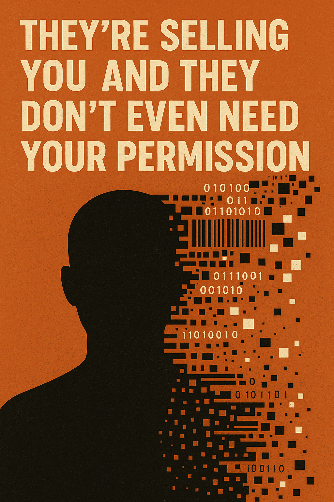

{: .img-right width="400" }

**Imagine this:**

A stranger knows your income, your credit score, your home address, your location at 2:36 PM yesterday, who you voted for, what religion you left, and whether you're pregnant.

Now imagine you never told them.  
Because you didn’t.  
Because they bought it.

Welcome to the United States of Surveillance.  
Where a decision made this week by a man you've never voted for just told the entire data broker industry: **carry on.**

---

## What Just Happened

On **May 14, 2025**, the **Consumer Financial Protection Bureau (CFPB)**, led by **acting director Russell Vought**, **withdrew a proposed rule** that would have forced data brokers to **get your consent** before selling your sensitive personal data—your Social Security number, your financial history, your behavioral profile[^1].

The rule, proposed under former CFPB director **Rohit Chopra**, was designed to classify data brokers under the **Fair Credit Reporting Act (FCRA)**, giving you back some control. But this week, the bureau declared that protecting you was "no longer necessary or appropriate"[^2].

Translation:  
**Your consent is officially optional.**

---

## The Stakes

Data brokers aren’t just annoying.  
They’re dangerous.

- In 2023, **Gravy Analytics** leaked movement data for military and government officials[^3].  
- **Arity**, a subsidiary of Allstate, allegedly sold driver data for **over 45 million Americans** without their knowledge[^4].  
- **People-search websites**, fed by brokers, help **abusers stalk their victims**[^5].  
- A **West Point-funded study** confirmed these ecosystems are an **active national security threat**—capable of **identifying, profiling, and blackmailing** service members[^6].

**And it’s not just theoretical.**  
Foreign governments have already **bought access to this data**, using it to track military personnel around sensitive U.S. installations[^7].

---

## Why They Did It

Because lobbying works.  
Because profit beats privacy.  
Because **you’re not the customer—you’re the product**.

The **Financial Technology Association** sent Vought a letter this week urging him to scrap the rule, claiming it would hurt “fraud detection”[^8]. That same tired line—used to justify everything from illegal surveillance to facial recognition dragnet tech.

And it worked.

So now, with **zero public hearings**, a **rule built on over 600 citizen comments** just evaporated.  
No debate. No warning. No vote.

---

## What’s Left of the Watchdog?

The CFPB used to be one of the last federal agencies still trying to fight for consumers.  
That changed fast.

Over **1,400 employees were laid off last month**, leaving only 300 to police a trillion-dollar economy[^9].

Elon Musk’s **Department of Government Efficiency (DOGE)**—yes, that’s real—has pushed to **dismantle the agency entirely**[^10].  
Musk himself has said the CFPB should be “deleted.”

Meanwhile, **your data keeps moving**—across servers, into dossiers, into hands you’ll never see.

---

## What You Can Do

### 🔥 Get Loud  
Call your representatives. Tag them. Blow up their inboxes. Demand legislation requiring **opt-in consent** for any sale of personal data.

### 🔥 Opt Out (Where You Still Can)  
Use services like [DeleteMe](https://joindeleteme.com), [Jumbo](https://www.jumboprivacy.com), or [SimpleOptOut](https://simpleoptout.com) to fight back.

### 🔥 Encrypt Everything  
Signal, VPNs, Firefox, privacy-respecting tools. Make tracking you **expensive**.

### 🔥 Vote  
For the love of all things digital and sacred—**vote like your privacy depends on it**.

---

## Final Word

You are not a datapoint.  
You are not an ad segment.  
You are not a profile to be auctioned off.

You are a person.  
And consent isn’t optional.

Not anymore.

---

## References

[^1]: [WIRED: CFPB Quietly Kills Rule to Shield Americans From Data Brokers](https://www.wired.com/story/cfpb-quietly-kills-rule-to-shield-americans-from-data-brokers/)  
[^2]: [Federal Register: Withdrawal Notice](https://www.federalregister.gov/public-inspection/2025-08644)  
[^3]: [WIRED: Gravy Analytics Leak](https://www.wired.com/story/gravy-location-data-app-leak-rtb/)  
[^4]: [Texas Attorney General’s Case Against Arity](https://www.texasattorneygeneral.gov/sites/default/files/images/press/Allstate%20and%20Arity%20Petition%20Filed.pdf)  
[^5]: [TechSafety.org on Data Brokers and Abuse](https://www.techsafety.org/data-brokers)  
[^6]: [West Point Study: Data Brokers and U.S. Military Personnel](https://techpolicy.sanford.duke.edu/wp-content/uploads/sites/4/2023/11/Sherman-et-al-2023-Data-Brokers-and-the-Sale-of-Data-on-US-Military-Personnel.pdf)  
[^7]: [WIRED: Brokers Sell Military Data via Google Tools](https://www.wired.com/story/google-dv360-banned-audience-segments-national-security/)  
[^8]: [FTA Letter to CFPB](https://www.ftassociation.org/wp-content/uploads/2025/05/FTA-Letter-on-OMB-Deregulation-RFI.pdf)  
[^9]: [WIRED: CFPB Gutted by Layoffs](https://www.wired.com/story/cfpb-has-been-gutted/)  
[^10]: [WIRED: Elon Musk and DOGE Agency](https://www.wired.com/story/elon-musk-digital-coup-doge-data-ai/)

---

*Published by [SentientCommons.org](https://sentientcommons.org) — where digital dignity still matters.*
